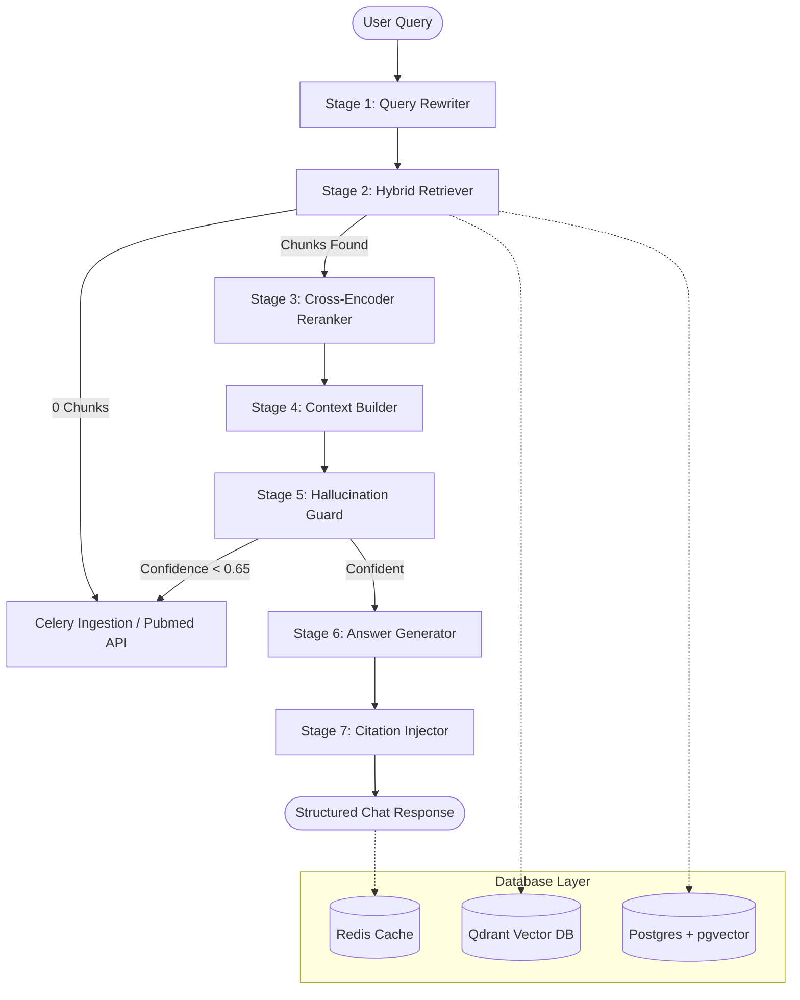

# MedRAG System Architecture & Step-by-Step Working

MedRAG is a production-grade clinical evidence assistant designed to answer complex medical queries exclusively from peer-reviewed literature. It implements a strict **zero-hallucination** architecture using a 7-stage pipeline, multi-layered guardrails, and hybrid retrieval mechanisms.

---

## 🏗️ Architectural Overview

The core system architecture consists of a reactive frontend (React, TypeScript, Tailwind CSS), a robust FastAPI backend, and a three-tier database layer hosted on Docker:

---

## 🔬 The 7-Stage Pipeline (Step-by-Step Working)

Every user query submitted to the MedRAG system flows sequentially through these seven stages:

### Stage 1: Query Rewriter (`app/rag/query_rewriter.py`)
- **Action**: The user's conversational query is sent to Google Gemini (`gemini-2.0-flash`).
- **Purpose**: It is expanded and rewritten into MeSH (Medical Subject Headings)-optimized PubMed search queries.
- **Example**: 
  - *Input*: "What's the best drug for diabetes?"
  - *Outputs*: `["type 2 diabetes mellitus pharmacological treatment", "metformin clinical trial efficacy diabetes"]`

### Stage 2: Hybrid Retriever (`app/rag/retriever.py`)
- **Action**: Queries are run simultaneously against two databases:
  1. **Dense Vector Search**: Qdrant retrieves relevant excerpts using cosine similarity on embeddings generated by `BAAI/bge-small-en-v1.5` (vector size 384).
  2. **Sparse Text Search**: PostgreSQL performs a Full-Text Search (FTS) using full-text indexes (`pg_trgm`/BM25-like indexing) to capture exact acronyms, dosages, and drug names.
- **Merge (RRF)**: Results from both searches are merged and normalized using **Reciprocal Rank Fusion (RRF)**.
- **Early Exit (Layer 1)**: If no chunks are found above the similarity threshold (`0.72`), the system triggers an automatic literature-seeding request or exits safely (returning a clear "No evidence found" response).

### Stage 3: Re-Ranker (`app/rag/reranker.py`)
- **Action**: Staged chunks are scored using a local Cross-Encoder model (`cross-encoder/ms-marco-MiniLM-L-6-v2`).
- **Purpose**: A Cross-Encoder processes the query and chunk text together, capturing deep semantic interaction and producing high-precision relevancy scoring. Chunks are sorted, and only the top `K` (default `5`) are selected.

### Stage 4: Context Builder (`app/rag/context_builder.py`)
- **Action**: The top-ranked chunks are assembled into a single clinical context string.
- **Purpose**: Excerpts are formatted with exact titles, authors, journals, and publication dates. Each snippet is assigned a strict index (`[Source 1]`, `[Source 2]`, etc.) to facilitate down-the-line grounding and prevent general context pollution.

### Stage 5: Hallucination Guard (`app/rag/hallucination_guard.py`)
- **Action**: An LLM-as-judge (Gemini) reviews the assembled context against the original query.
- **Purpose**: It strictly evaluates whether the retrieved literature contains direct, concrete evidence to answer the query.
- **Confidence Threshold**:
  - If `has_answer` is `True` and confidence is `>= 0.65`, the pipeline continues.
  - If confidence is `< 0.65` or `has_answer` is `False`, the system halts and gracefully outputs a structured "I don't know" explanation rather than making a guess.

### Stage 6: Answer Generator (`app/rag/answer_generator.py`)
- **Action**: Gemini receives the query and context alongside 10 rigid clinical rules.
- **Constraints**: 
  - External knowledge is 100% prohibited.
  - Factual assumptions or extrapolation beyond the text are blocked.
  - Every factual claim must be followed by a source citation tag `[Source N]`.
- **Post-Verification (Layer 4)**: If the LLM generates a response with `0` citation links, the backend automatically flags it as potentially hallucinated and replaces it with a safe failure message.

### Stage 7: Citation Injector (`app/rag/citation_injector.py`)
- **Action**: The plain-text answer is parsed and formatted.
- **Output**: Mentions of `[Source N]` are mapped to detailed metadata objects (including PMID, DOI, authors, journal, publication date, and snippet) to render beautiful clickable citation cards in the frontend, ensuring absolute transparency.

---

## 🛡️ The 7-Layer Anti-Hallucination Strategy

| Layer | Component | Grounding Check | Action on Failure |
|---|---|---|---|
| **1** | `pipeline.py` | Checks if retrieved document count is greater than 0. | Safely aborts or requests Celery to index the topic immediately. |
| **2** | `hallucination_guard.py` | LLM-as-judge validates sufficiency of evidence. | Aborts RAG pipeline if confidence score is < 0.65. |
| **3** | `answer_generator.py` | System prompt explicitly bans all external training knowledge. | Restricts response to provided context boundaries. |
| **4** | `answer_generator.py` | Checks generated response for presence of `[Source N]` tokens. | If citation count is 0, discards answer and outputs failure message. |
| **5** | `hallucination_guard.py` | Flags tangentially related context as insufficient. | Rejects query to prevent speculative assumptions. |
| **6** | `pipeline.py` | Rigid, templated failure messages. | Prevents conversational drift when RAG fails. |
| **7** | `pipeline.py` | Conditionless medical disclaimer appended to every payload. | Restricts clinical liability. |
